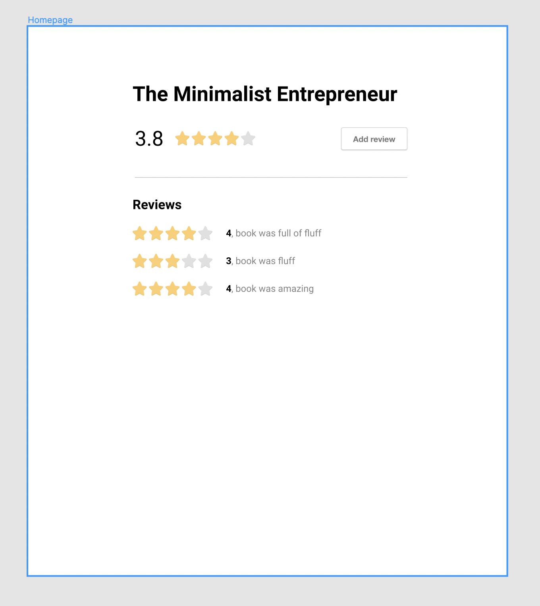
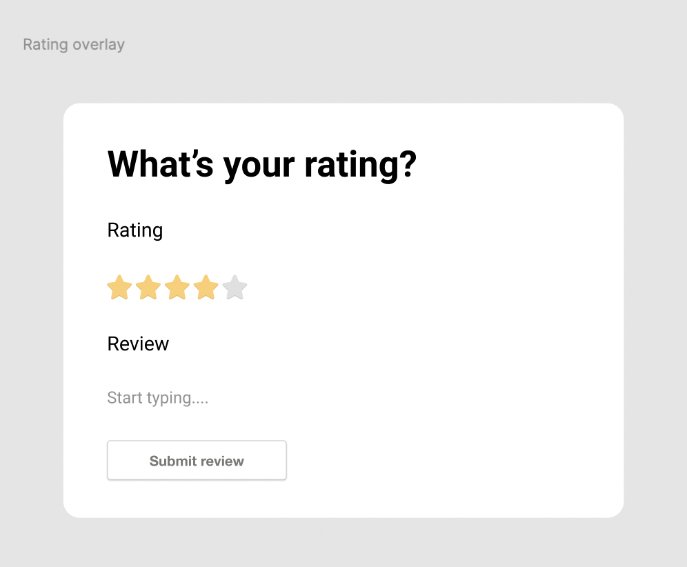

<!-- insert image in markdown here -->

# A Star Ratings Exercise

mvp-1 is the fullstack app with the vanilla frontend

mvp-2 is the fullstack app with the react frontend

see respective subfolders for info on setup

live versions are here:

[mvp-1](https://master.d3142dtarxgj25.amplifyapp.com/)

[mvp-2](https://master.d1nntgscnerfyj.amplifyapp.com/)

[figma mockup](https://www.figma.com/file/TJhxC8lKKsobprIHmwa3K0/Ratings-challenge-(Copy))

## Architecture

I went with client-side rendered typescript for the v2 frontend.

Went with an Infrastructure as Code pattern for the backend made with the serverless SST framework in typescript deployed on AWS.

Improvements:

- Server-side rendering would be cool for SEO and other niceties Next.js affords

- Micro-frontends could be a thing though those are harder to setup. Might help with more silo'd development

- Using Formik for forms so they're handled more easily/robustly

- I considered a hover interaction for half star reviews.
  Based on how that would've been untenable with mobile devices, I went with taps instead.

